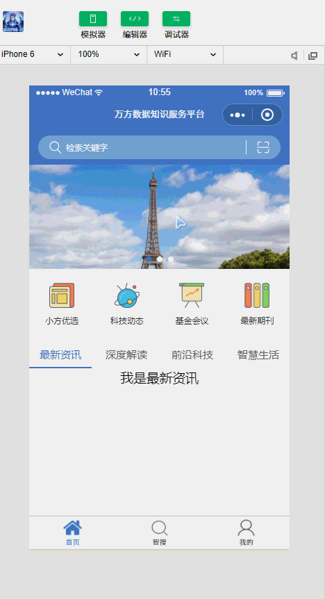

# 提前预览
<!--  -->

## 主要功能

  > 模拟万方数据app进行小程序代码的开发

## 步骤：

  * 切换到server目录下，运行node server  ||  npm start
  * 运行Robomongo mongodb可视化工具查看数据
  * 打开微信开发者工具查看小程序demo

## 注意点：

  * 查询数据库的find方法后续版本中可能被弃用
  * wxss的单位要酌情使用rpx
  * 不同页面间传递值
  * 自己本地启动服务要进行设置：点击微信开发者工具右上角的详情按钮
    选中不校验合法域名、web-view(业务域名)、TLS版本以及https证书
  * 在自己自定义签名https证书的时候直接在官网下载所需版本
    [openssl官网](https://www.openssl.org/source/) 
    [证书生成地址](https://cnodejs.org/topic/54745ac22804a0997d38b32d)
  * 自己下载下项目的时候请修改project.config.json中的appid为你自己的id

